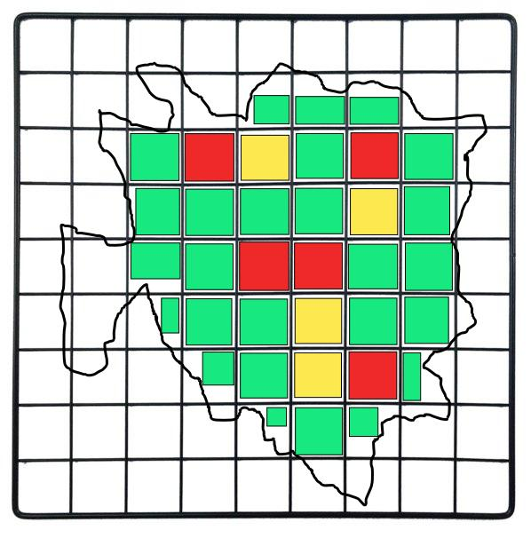

# Kowalski, analysis!

## Confronto tra mezzi pubblici e privati nell'area di Milano basato su dati estratti da servizi
#### (Università degli Studi di Milano. Tesi di Mauro Mastrapasqua)

### 0. Domande a cui voglio rispondere

- Qual e' il mezzo piu' economico per spostarsi nella citta' di Milano?
	- nei giorni feriali
	- nel weekend
- Qual e' il mezzo piu' veloce per spostarsi nella citta' di Milano?
	- nei giorni feriali
	- nel weekend
- Esistono orari con eccezioni?
- Esistono giorni con eccezioni?
- Esistono aree con eccezioni?
- Qual e' il mezzo migliore in rapporto soldi/velocita'?
- Qual e' il mezzo migliore in rapporto (soldi/velocita')/inquinamento?

### 1. Piano di elaborazione dati

Per effettuare questo studio ho deciso di usare **2 METODI** che eseguiro' parallelamente per diversi mesi, ovvero:

1. **Dati a confronto col passato**: partendo dalle tratte piu' frequentemente percorse estratte dai dati di Losacco, instrumento il multiscraper per richiedere a tutti i servizi di calcolare il tempo di percorrenza di tutte le tratte frequenti a intervalli regolari di 15 minuti, dalle ore 06:00 alle ore 23:00 di ogni giorno feriale, dalle ore 06:00 alle 01:00 nei giorni festivi, per mesi
1. **Dati a confronto in tempo reale**: creero' un programma per generare tratte casuali ben studiate (da semicentro a centro e periferia, da periferia a semicentro e centro ecc...). Una volta create le tratte, usando i miei scraper e gli scraper di Losacco con l'aggiungenta del calcolo di percorso a piedi per raggiungere la macchina piu' vicina, andro' a fare lo stesso lavoro di scraping su tutti i servizi (stesso intervallo, stessi orari, per mesi, parallelamente al primo).

**Motivazione**: (1) Dai dati di Losacco non posso sapere quanto ci mette l'utente in media a raggiungere la macchina. (2) ridondanza, confronto passato-presente, garanzia e qualita' dei dati. I risultati dei due metodi li confrontero' per avere la certezza e per accorgermi di eventuali incongruenze.

### 2. (1° METODO) Dati a confronto col passato
#### 2.1 Dati a disposizione (da Losacco Federico)

##### 2.1.1 Elenco dati raccolti

|Nome|Inizio|Fine|Pause|Veicoli|
|-|-|-|-|-|
|Enjoy|luglio 2015|-|Si|Auto,Scooter|
|SharenGo|luglio 2015|-|Si|Auto|
|Car2Go|luglio 2015|-|Si|Auto|
|Twistcar|?|dismesso|?|Auto|

##### 2.1.2 Normalizzazione (MongoDB)

|Attributi|Descrizione|
|-|-|
|car_plate|identificativo veicolo(targa)|
|latitude|latitudine|
|longitude|longitudine|
|loc|indice geospaziale|
|service_name|nome servizio|
|date|timestamp rilevazione (ogni 1 o 5 min)
|fuel|carburante attuale (liquido o elettrico)|
|engine|tipo di motore (combustione o elettrico)|
|type_v|tipo di vettura (auto o motorino)|
|id|numero sequenziale inserimento|

#### 2.2 Estrazione delle tratte piu' frequenti

##### 2.2.1 Estrazione tratte (gia fatto?)

I dati raccolti da Federico Losacco sono rilevazioni di macchine sulla mappa nel tempo, quindi ogni record comprende coordinate geografiche e data. Dato che, nelle ore diurne, le macchine vengono prese esclusivamente dagli utenti del servizio, **ogni coordinata di rilevazione della macchina (macchina libera) corrisponde con la fine del tragitto dell'utente precedente**, almeno in termini di spazio (ma non di tempo per possibili ritardi o gap nel campionamento). Per risalire al tragitto percorso dall'utente precedente, basta cancellare tutte le rilevazioni ridondanti, come nell'esempio:

1. ~~Macchina M a coordinate 1,1 alle 15:05~~ inutile, stesse coordinate
1. ~~Macchina M a coordinate 1,1 alle 15:10~~ inutile, stesse coordinate
1. Macchina M a coordinate 1,1 alle 15:15 **utente U prende macchina**
1. Macchina M a coordinate 2,2 alle 15:55 **utente U rilascia macchina**
1. ~~Macchina M a coordinate 2,2 alle 16:00~~ inutile, stesse coordinate
1. ~~Macchina M a coordinate 2,2 alle 16:05~~ inutile, stesse coordinate

eliminando i record inutili posso capire che l'utente U ha viaggiato da (1,1) a (2,2) in un tempo <= 40 minuti. Applicando questo filtro a tutte le rilevazioni registrate, ottengo un database pulito di tragitti percorsi da utenti del servizio di car sharing.

*definizione record inutile*: un record e' inutile se e solo se ha le stesse coordinate del record precedente e del record successivo. (infatti, nell'esempio, le rilevazioni 1 e 6 non so se sono inutili, perche' non so cosa c'e' prima di 1 e dopo 6)

##### 2.2.2 Calcolo tratte piu' frequenti

Un conteggio pari-pari delle tratte (stesse coordinate di partenza e arrivo) non e' la cosa piu' intelligente da fare, perche' (1) le coordinate sono dei double e (2) se volessi andare in Duomo con una macchina, di certo non parcheggerei dentro il Duomo ma nell'area intorno (dentro i 500 metri di raggio), cosi' per ogni meta in citta'. Il punto (2) va tenuto a mente anche per il punto di partenza delle macchine, perche' 2 utenti possono aver percorso la stessa tratta ma partendo da 2 posti non esattamente uguali, ma molto vicini. Per cercare le tratte piu' frequenti usero' il seguente metodo:

1. Creo una matrice che "racchiude" Milano sotto forma di coordinate geografiche: ogni indice di riga corrisponde a un gap in latitudine di un certo spazio (500 metri = 0.00x in latitudine) e ogni indicie di colonna a un gap in longitudine. Questa matrice sara' definita con la seguente struttura dati:

```go
type Cell struct {
	count            int
	ridesThatEndHere []Ride
}

type Matrix [n][m]Cell
```

2. Per ogni tratta nel database, uso le coordinate di arrivo per smistarla "geograficamente" dentro la matrice, incrementando `count` e aggiungendola alla lista `ridesThatEndHere`. Alla fine del processo ottengo una matrice con salvati tutti gli "hit" delle tratte che sono terminate nelle varie caselle. Da questa matrice sono in grado di ricavare le zone piu' "calde", se esistono. Esempio visivo di un possibile scenario:




### 3. (2° METODO) Dati a confronto in tempo reale

### 4. TODO

1. Decifrare i parametri inviati nelle richieste dai servizi con piu' opzioni (tipo: Moovit ti fa scegliere una combinazione tra tram, metro, bici, piedi, passante ecc...)
1. Dividere Milano in aree come Area C, centro, semicentro e periferia per ulteriori analisi a posteriori
1. ~~Decodificare i JSON derivanti dai vari servizi in una struttura dati comune che comprenda:~~ **Finito il 14/1/'20**
	- coordinate di partenza
	- coordinate di arrivo
	- tempo tragitto
	- costo tragitto
	- coordinate di ogni step del percorso (se possibile)
	- aree attraversate
1. ~~Creare un programma che date delle coordinate di partenza e di arrivo, lanci in parallelo le richieste di quel tragitto su ogni scraper a disposizione a intervalli regolari di tot minuti (nb: usare vpn per evitare blacklist ip)~~ **Bozza pronta**

---

# Diary

## TODO
- ~~tentare lo scraping di Waze~~ **Finito il 21/11/'19**
- ~~finire lo scraper di Moovit~~ **Finito il 27/10/'19**
- ~~tentare lo scraping dei dati del traffico su Google~~ **Abbandonato perche' overcomplicated**

## Diary

#### 10/10/'20

modularizzazione effettuata per consentire a un programma di effettuare richieste multiple. Manca normalizzazione dei dati a una struttura dati comune.

#### 21/11/'19

lo scraper di Waze e' completato. Inizio analisi dei dati restituiti per creazione di struttura dati comune per normalizzare tutte le informazioni provenienti dai diversi scraper.

#### 08/11/'19

scraping di Google abbandonato perche' eccessivamente complicato. Waze.com vanta pari affidabilita' nel calcolo delle rotte e restituisce i risultati con un unico JSON di risposta contenente il tempo di percorrenza per ogni tratta suggerita. Come Moovit non ha endpoint statici ma la richiesta va costruita per step successivi con scambi di cookie e tokens.

Problemi da risolvere:
- ~~Waze restituisce un JSON di risultati molto pesante (0.5MB). Fare attenzione a non venire bloccati o trovare un modo per limitare la risposta~~ **Risolto il 21/11/'19: attributo "nPaths" e "include*" nel json**
- Studiare il protocollo dello scambio dei dati

#### 27/10/'19

lo scraper di Moovit e' completato. I json parziali vengono riuniti sotto un'unica struttura dati.

Turno di Google: tutte le comunicazioni avvengono tramite blob illeggibili, tranne che per 2 richieste:
1. settaggio del luogo di partenza/arrivo (tramite coordinate o senza)
	- simile a Moovit, per ogni luogo serve sapere il suo ID associatogli dal sito per poterlo usare nelle richieste
2. informazioni del tragitto (km, tempi di percorrenza, traffico e altri dati)
	- queste informazioni vengono spedite tramite un simil-JSON monnezza
		- formato solo da parentesi quadre (array innestati)
		- l'unmarshaling fallisce sempre perche' viene inviato appositamente con errori di sintassi (unexpected '[' at ...)

Problemi da risolvere:
- trovare endpoint API per associare coordinate a un ID
- analizzare il simil-JSON e vedere se e' correggibile

#### 22/10/'19

lo scraper di Moovit funziona dinamicamente con query a runtime. Manca l'estrazione e l'elaborazione dei dati dei json di risposta e il controllo di coerenza/consistenza delle informazioni.

#### 21/10/'19

lo scraper di Moovit funziona coi parametri hard-coded dopo aver simulato completamente una sequenza di query del browser. Manca la possibilita' di fare query a runtime (non hard-coded) e manca gestione dati (tempo, linea ecc...)

Problemi da risolvere:
- ~~Trovare un modo di capire a runtime quante query sono necessarie per avere un json completo con tutte le tratte.~~ **Risolto il 27/10/'19: attributo "completed" nel json**
- ~~capire perche' 2 volte su 10 le query falliscono~~ **Risolto il 22/10/'19: Le query non falliscono piu', c'e' solo da gestire la componente random dei json spezzati**

#### 15/10/'19

lo scraper di Moovit non funziona coi parametri hard-coded di header, params e cookies. Da ritentare dinamicamente, simulando alla perfezione tutto lo scambio dati che avviene nel browser.

#### 11/10/'19

il sito web di Moovit (moovitapp.com) e' un endpoint per le API, possibile scrapare. L'acquisizione dati avviene in 4 step:
- HTTP GET -> per inviare i parametri del percorso richiesto (luogo di partenza, luogo di destinazione)
- <- RESPONSE (json) si riceve un token da Moovit da usare nella prossima richiesta
- HTTP GET + token -> si richiedono i risultati della query iniziale
- <- RESPONSE (huge json) tutti i risultati

Problemi da risolvere:
- ~~A ogni via/luogo e' associato un ID da inviare nelle richieste, si puo' scrapare anche senza? Altrimenti, esiste API per ricavare l'ID di un luogo dal suo nome informale? (tipo: getLocID("Via Comelico") -> 64564)~~ **Risolto il 21/10/'19: Il problema non si pone perche' Moovit da la possibilita' di cercare posti con le coordinate (lat,lon) e in risposta da tutti i dati associati di quelle coordinate (compreso di nome della via, civico e un id)**

- ~~Una volta acquisito il token, tutta la sequenza prosegue flawless?~~ **Parzialmente risolto il 21/10/'19: L'unico problema e' che Moovit restituisce json spezzati a random: puoi ricevere tutto l'array con la prima query, altrimenti devi fare piu' query e riunire gli elementi restituiti (ecco spiegato il parametro ?offset= nelle query). Da trovare modo per riunificarlo nel codice** | **Risolto il 27/10/'19**

---

# Scrapers

## A disposizione

`$REPODIR/tesi-traffico/codice/scraper/module/`

- Car2Go
- Enjoy
- SharenGo

`$REPODIR/kowalskyanalysis/src/scrapers/`

- Moovit
- Waze

## Da trovare...
- MyTaxi
- BikeMi (Gia fatto?)
- MiMoto
- DriveNow
- Google (overcomplicated)
